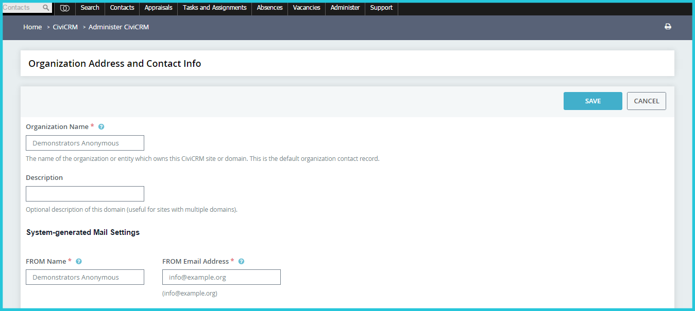
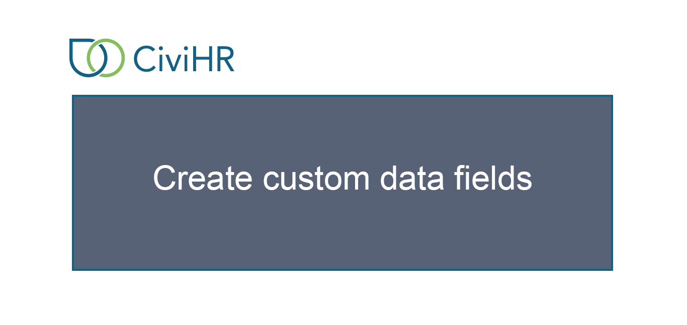

Customise the user interface
==========

### Change display preferences  

You can pick which fields and tabs should appear when you add a new individual in CiviHR. To do this, go to **Administer > Customise Data and Screens > Display Preferences**. Select the appropriate boxes next to **Editing Contacts:**

For example, if your organisation doesn't collect information on Demographics or Instant Messenger, you could uncheck those boxes and streamline the editing screen. Any information contained in fields you choose not to display remains in your database, and you can choose to display it again at any time by re-checking the boxes in this setting.

### Change terminology using Word Replacement  

CiviHR has a Word Replacement setting that lets you replace existing text with other text. For example, if your organisation prefers to use the term "Employee ID," instead of the term “External ID” that appears in CiviHR, you can define a word replacement and have it automatically altered everywhere on CiviHR.

Go to **Administer > Customise Data and Screens > Word Replacements**.
Enter the exact word or text you want to replace under the column titled 'Original'. Please note this is case sensitive and requires the same exact spelling of the word or text which you see in CiviHR.
On the Replacement column, add the desired phrase that you would like to replace the original word or text with.
Check the ‘Exact Match’ and ‘Enabled’ boxes. 
You can add additional rows using the Add row button. 
Click Save when you are finished entering replacements.

When using this function, be sure to anticipate alternate forms of words and different ways your chosen word or phrase may appear in your CiviHR installation.

### Change dropdown options

You can customise (add / rename / disable / remove) some of the dropdown options you see on CiviHR. Go to **Administer > Customise Data and Screens > Dropdown Options** to customise dropdowns. Customisable fields include: 

-   Gender Options: eg. Male, Female, Transgender
-   Individual prefixes and suffixes: eg. Ms., Mr. and Jr., Sr.
-   Instant messenger services: eg. GTalk, Skype
-   Location types: This list is used to define the types of email addresses, phones and address that you would like to save for your staff members, e.g., Work, Home, Personal. Phones and email addresses that are labelled Work or Personal show up in the Self Serve Portal.
-   Phone types: eg. Phone, Mobile, Work. 
-   Website types: eg. LinkedIN, Twitter. Input the full URL including http:// or https:// that you see at the beginning. 
-   Job Contract Pay Scale: If your organisation uses pay scales or grades, you can add them here. When you add a new option, you will need the following information:

The information in this table gets listed as options in the job contracts pay scale dropdown as E1 – CXO  – GBP 80000.00 per Year and so on. 
If you have pay defined in bands (say Manager, GBP 40000 - 50000 pa), use the smaller number as the Amount. If your organisation does not make use of pay scales or grades, you can use the ‘Not Applicable’ option. 
-   Job Contract Hours/Location: Input the standard full time hours for each of your locations. For example, your head office might have 37.5 hours per week as its standard full time hours, while a branch office might be on 35 hours per week for full time work. 	 

    The information in this table gets listed as options in the job contract standard hours dropdown as Head office - 37.50 per Week and so on. Set the default option. 
-   Contract Type: eg. Employee - Permanent, Employee - Temporary, Consultant. 
-   Normal Place of Work (Job Contract) and Location (Job Roles): Normal place of work is the contractual place of work for your staff. 
-   The same list is also used for Location in Job Role screen. The staff’s current job role location could be different than their contractual location. For example, they might be spending six months at a different office in order to complete a project. 
-   You can use Locations to specify which staff records can be accessed by which fellow administrators through the **Manage Roles** and Teams feature. 
-   Pay Cycle: This is the interval at which staff gets paid. eg. Weekly, Monthly.
-   Benefits: This list contains names of all monetary benefits that staff may get as part of their pay. Benefits are added as annual amounts, and CiviHR calculates the benefit amount per cycle.  eg. Cycle allowance, Dental 
-   Deductions: This list contains names of all monetary deductions made from the pay of your staff. are added as annual amounts, and CiviHR calculates the benefit amount per cycle. eg. Child Maintenance, Disciplinary, Loan
-   Pension Provider Type: This screen can be used to add different pensions that your organisation offers its staff.
-   Reason for Change: This list contains brief reasons for why the terms of a contract could be revised. eg. Promotion, Pay Raise
-   Reason for Job Contract End: It is helpful to add options that could give you insights into attrition at your organisation. eg. Voluntary, Involuntary, Retirement

There are more dropdown options that can be customised (add/rename/disable/remove) from **Administer > System Settings > Option Groups**. These include:

-   Cost Centres: These are internally used budgeting or accounting codes used to book your staffs’ pay. Staff members can have multiple job roles, and each role can be associated with multiple cost centres. 
-   Department: This set of options is helpful when you need to analyze staff headcount / gender / age etc. by department.
-   Ethnicity: This set of options is useful for diversity related reports. Prefer Not To Say and Not Applicable are pre-configured for you. 
-   Government ID: This list contains different types of government-issued proof of identity. 
-   Level: This set of options is helpful when you need to analyze staff headcount / gender / age etc. by seniority level. eg. Field Staff, Executive, Manager, C-Suite
-   Marital status: This set of options is useful for diversity related reports. Prefer Not To Say and Not Applicable are pre-configured for you.
-   Region: This set of options is helpful when you need to analyze staff headcount / gender / age etc. by region. You can also use Regions to specify which staff records can be accessed by which fellow administrators through the **Manage Roles and Teams** feature. 
-   Relationship with employee: This set of options helps you to add the relationship between staff members and their emergency contacts.
-   Religion: This set of options is useful for diversity related reports. Prefer Not To Say and Not Applicable are pre-configured for you.
-   Sexual orientation: This set of options is useful for diversity related reports. Prefer Not To Say and Not Applicable are pre-configured for you.

### Add your organization’s contact information

Go to **Administer > Communications > Organization address and contact info** and enter organization name and address. Enter a valid email address that should be used by default to send CiviHR-generated emails such as task notifications.

### Create custom data fields

You can collect information beyond that which CiviHR allows by default by adding custom fields to hold the data you want to save. Contact your service provider to plan this.

